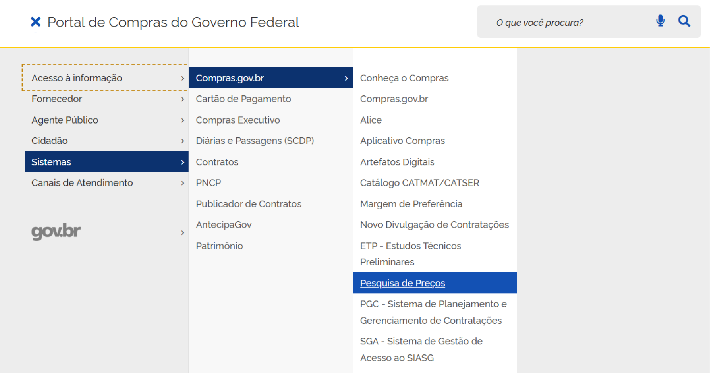

 Tamanho do texto:
 <button onclick="diminuirFonte()" title="Diminuir texto" style="padding: 6px 12px; font-weight: bold; cursor: pointer; border: 1px solid #ccc; border-radius: 4px; background: #f8f9fa;">A-</button>
 <button onclick="resetarFonte()" title="Tamanho normal" style="padding: 6px 12px; font-weight: bold; cursor: pointer; border: 1px solid #ccc; border-radius: 4px; background: #f8f9fa;">A</button>
 <button onclick="aumentarFonte()" title="Aumentar texto" style="padding: 6px 12px; font-weight: bold; cursor: pointer; border: 1px solid #ccc; border-radius: 4px; background: #f8f9fa;">A+</button>
 
<button onclick="window.print()" style="background-color: #0056b3; color: white; padding: 6px 16px; border: none; border-radius: 5px; font-size: 14px; cursor: pointer; box-shadow: 0 2px 4px rgba(0,0,0,0.2); margin-left: 10px;">
 🖨️ Imprimir ou baixar esta página
 </button>

# ACESSANDO O PESQUISA DE PREÇOS LITE

**Passo 01:** Acesse o [Portal de Compras do Governo Federal](https://www.compras.gov.br)[cite: 1].

**Passo 02:** No canto superior esquerdo, localize o ícone com três linhas[cite: 1].

**Passo 03:** Ao clicar no ícone com três linhas, será exibido um menu lateral. Arraste o cursor até a opção **Sistemas**, depois **Compras.gov.br** e, em seguida, **Pesquisa de Preços**[cite: 1].

**Passo 04:** Na página do Pesquisa de Preços, clique no botão **Pesquisa de Preços Lite**[cite: 1].

 

 <button onclick="window.print()" style="background-color: #0056b3; color: white; padding: 10px 20px; border: none; border-radius: 5px; font-size: 16px; cursor: pointer; box-shadow: 0 2px 4px rgba(0,0,0,0.2);">
 🖨️ Imprimir ou baixar esta página
 </button>

