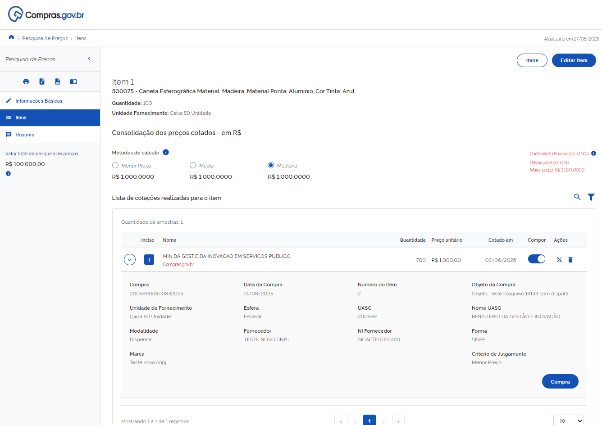
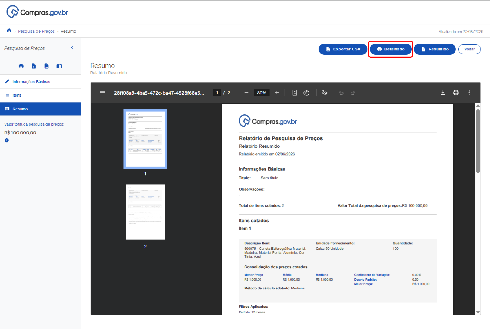

 Tamanho do texto:
 <button onclick="diminuirFonte()" title="Diminuir texto" style="padding: 6px 12px; font-weight: bold; cursor: pointer; border: 1px solid #ccc; border-radius: 4px; background: #f8f9fa;">A-</button>
 <button onclick="resetarFonte()" title="Tamanho normal" style="padding: 6px 12px; font-weight: bold; cursor: pointer; border: 1px solid #ccc; border-radius: 4px; background: #f8f9fa;">A</button>
 <button onclick="aumentarFonte()" title="Aumentar texto" style="padding: 6px 12px; font-weight: bold; cursor: pointer; border: 1px solid #ccc; border-radius: 4px; background: #f8f9fa;">A+</button>
 
<button onclick="window.print()" style="background-color: #0056b3; color: white; padding: 6px 16px; border: none; border-radius: 5px; font-size: 14px; cursor: pointer; box-shadow: 0 2px 4px rgba(0,0,0,0.2); margin-left: 10px;">
 🖨️ Imprimir ou baixar esta página
 </button>

# INDICADORES, RELATÓRIOS E FINALIZAÇÃO

## Indicadores e Gestão de Cotações

O Pesquisa de Preços Lite exibe indicadores em tempo real para auxílio na definição do valor de referência[cite: 1]:

* **Métodos de Cálculo:** Permite visualizar e alternar o critério de obtenção do preço estimado entre **Menor Preço**, **Média** ou **Mediana**. O método selecionado influenciará diretamente o valor de referência calculado pelo sistema[cite: 1].
* **Painel de Controle Estatístico:** Localizado à direita, apresenta o coeficiente de variação, o desvio padrão e o maior preço encontrado na amostra, servindo de parâmetro para analisar a homogeneidade e a segurança dos dados[cite: 1].

A plataforma também exibe a relação de contratações públicas selecionadas para compor os preços[cite: 1]. É possível detalhar cada compra expandindo o registro para visualizar o número do processo, a modalidade de contratação, os dados do fornecedor, marca do produto e critério de julgamento[cite: 1].

!!! warning "Atenção"
    É possível gerenciar as contratações que compõem a pesquisa de preços[cite: 1]:
    
    * **Coluna Compor:** Permite ativar ou desativar uma cotação específica. Quando desativada, o valor é excluído dos cálculos estatísticos[cite: 1].
    * **Coluna Ações:** O ícone de lixeira exclui o registro da lista do item[cite: 1].

---

## Finalização e Emissão de Relatórios

**Passo 15:** Após preencher os campos obrigatórios de identificação e escolher as cotações que farão parte da pesquisa, clique na aba **Resumo**[cite: 1].

Na página de **Resumo**, é possível realizar as seguintes ações[cite: 1]:

1. **Baixar o Relatório Resumido:** Clique no botão **Resumido** para gerar o relatório consolidado em formato PDF[cite: 1].
2. **Baixar o Relatório Detalhado:** Clique no botão **Detalhado** para gerar o relatório em PDF com a média e mediana dos últimos 12 meses, calculadas a partir das compras homologadas de todos os itens, além dos dados individuais de cada item[cite: 1].
3. **Exportar Dados:** Clique em **Exportar CSV** no canto superior direito para extrair os dados em formato editável[cite: 1].

4. **Salvar a Pesquisa:** Para armazenar a consulta na sua conta, clique no botão **Salvar Pesquisa**. Se já tiver feito login via Gov.br, o salvamento será confirmado imediatamente; caso contrário, será exibida a tela de autenticação do Gov.br[cite: 1].

!!! warning "Atenção"
    Ao clicar no botão **Home** ou **Voltar** sem estar autenticado via Gov.br ou sem salvar a pesquisa, a consulta será encerrada e os dados serão perdidos[cite: 1]. Para garantir que seu trabalho seja salvo, utilize o botão **Salvar Pesquisa** com o login Gov.br antes de sair[cite: 1].

---

## Canal de Suporte

Caso tenha dúvidas ou precise de suporte, a Central de Atendimento do Ministério da Gestão e da Inovação em Serviços Públicos (MGI) está disponível[cite: 1]:

* **Portal de Serviços:** Acesso via sistema[cite: 1].
* **Telefone:** 0800 978 9001 (de segunda a sexta-feira, das 8h às 18h)[cite: 1].

 

 <button onclick="window.print()" style="background-color: #0056b3; color: white; padding: 10px 20px; border: none; border-radius: 5px; font-size: 16px; cursor: pointer; box-shadow: 0 2px 4px rgba(0,0,0,0.2);">
 🖨️ Imprimir ou baixar esta página
 </button>

