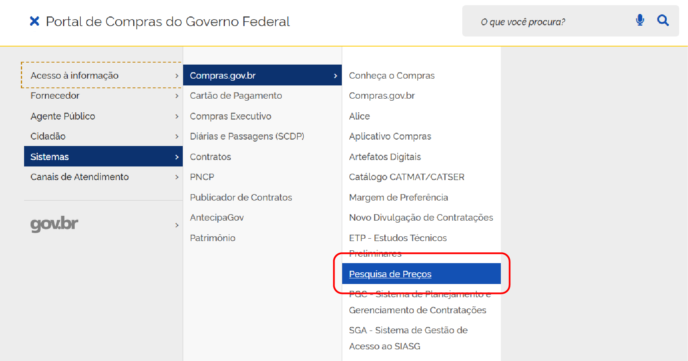
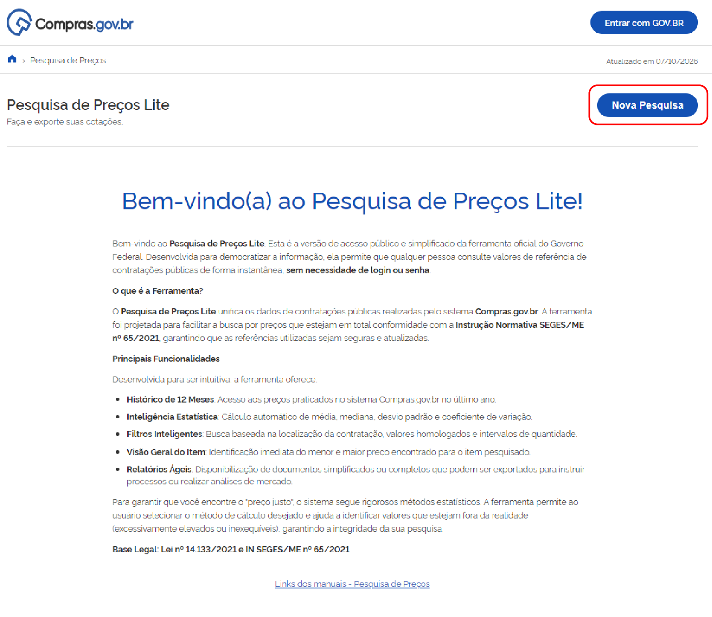
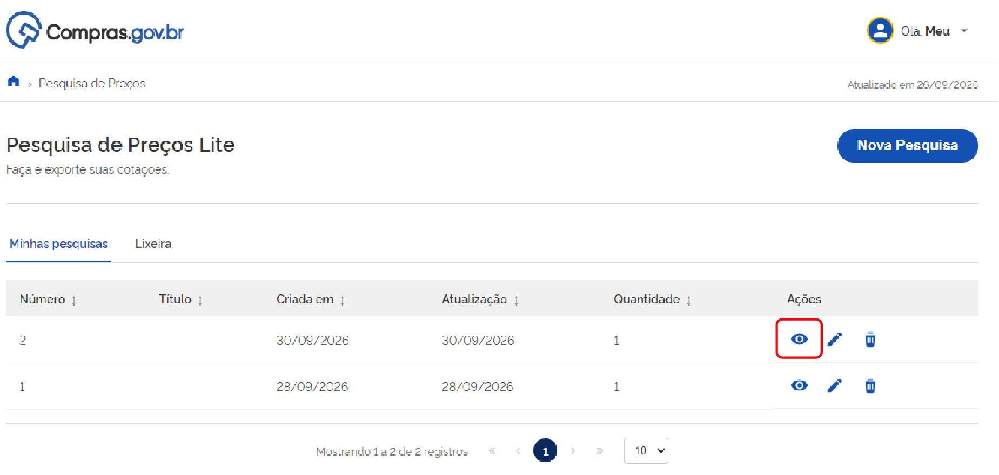
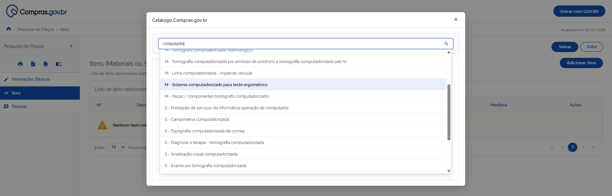
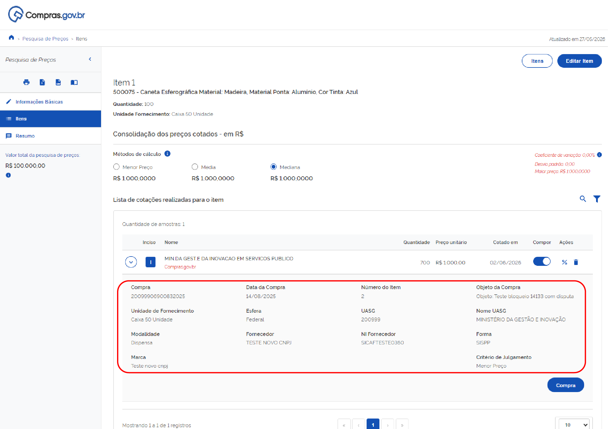
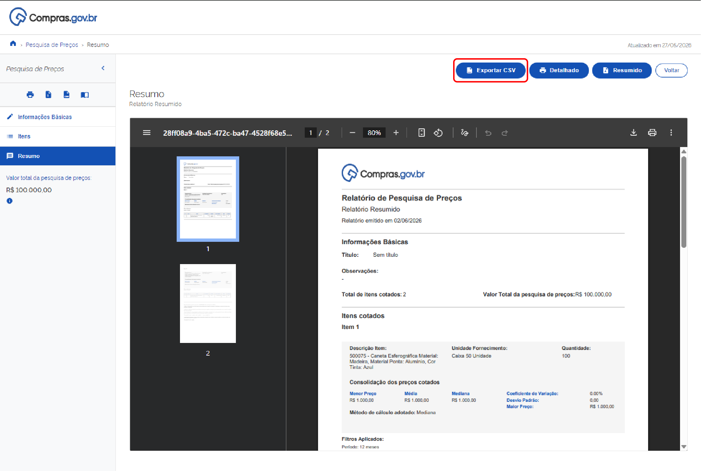

 Tamanho do texto:
 <button onclick="diminuirFonte()" title="Diminuir texto" style="padding: 6px 12px; font-weight: bold; cursor: pointer; border: 1px solid #ccc; border-radius: 4px; background: #f8f9fa;">A-</button>
 <button onclick="resetarFonte()" title="Tamanho normal" style="padding: 6px 12px; font-weight: bold; cursor: pointer; border: 1px solid #ccc; border-radius: 4px; background: #f8f9fa;">A</button>
 <button onclick="aumentarFonte()" title="Aumentar texto" style="padding: 6px 12px; font-weight: bold; cursor: pointer; border: 1px solid #ccc; border-radius: 4px; background: #f8f9fa;">A+</button>
 
<button onclick="window.print()" style="background-color: #0056b3; color: white; padding: 6px 16px; border: none; border-radius: 5px; font-size: 14px; cursor: pointer; box-shadow: 0 2px 4px rgba(0,0,0,0.2); margin-left: 10px;">
 🖨️ Imprimir ou baixar esta página
 </button>

# ACESSO E RECUPERAÇÃO DE PESQUISAS

**Passo 01:** Acesse o Portal de Compras do Governo Federal pelo link [https://www.compras.gov.br](https://www.compras.gov.br).

**Passo 02:** No canto superior esquerdo, localize o ícone com três linhas.

**Passo 03:** Ao clicar no ícone com três linhas, será exibido um menu lateral. Arraste o cursor até a opção **Sistemas**, depois **Compras.gov.br** e, em seguida, selecione **Pesquisa de Preços**.

**Passo 04:** Na página do Pesquisa de Preços, clique no botão **Pesquisa de Preços Lite**.

**Passo 05:** Caso deseje iniciar uma pesquisa do zero (com ou sem login), clique no botão **Nova Pesquisa**.

**Passo 06 (Recuperação):** Caso deseje recuperar pesquisas anteriores ou garantir que sua nova consulta fique salva, clique em **Entrar com GOV.BR** no canto superior direito e faça a autenticação com seu CPF e senha.

Após o login, a página inicial exibirá a lista **Minhas Pesquisas**. Para recuperar uma consulta salva anteriormente e continuar a edição ou emitir relatórios, localize a pesquisa desejada e clique no ícone de **Abrir/Visualizar** (ou no título da pesquisa).

# PESQUISA E EDIÇÃO DE ITENS

**Passo 07:** Preencha os campos com o título e as observações da consulta. Em seguida, clique em **Itens**.

**Passo 08:** Na opção **Itens**, clique no botão **Adicionar Item** para incluir o material ou serviço que deseja pesquisar.

**Passo 09:** No campo de texto, descreva de forma resumida o item que deseja pesquisar e selecione a opção mais adequada: **Material** ou **Serviço**.

!!! note "Nota"
    O sistema exibe as opções do catálogo oficial do Compras.gov.br:
    
    * Os itens identificados com a letra **M** antes do nome correspondem a **Materiais** (ex.: `M - Computador`).
    * Os itens identificados com a letra **S** correspondem a **Serviços** (ex.: `S - Manutenção de Computador`).

**Passo 10:** No painel de consulta, selecione o item desejado. Informe a quantidade, a unidade de fornecimento e as características necessárias para refinar a pesquisa. Após preencher os campos obrigatórios, clique em **"+"** para incluir o item na lista.

**Passo 11:** Caso deseje alterar a pesquisa, clique no ícone de **Editar item** (caneta) ou em **Excluir Itens** (lixeira vermelha).

**Passo 12:** Após clicar em **Editar item**, o sistema abrirá a tela de edição. No topo da página, são exibidas as informações oficiais do catálogo do Compras.gov.br (CATMAT para materiais ou CATSER para serviços):

* **Descrição do Item:** Código e descrição padronizada (ex.: `500075 - Caneta Esferográfica Material: Madeira`).
* **Quantidade e Unidade de Fornecimento:** Quantidade estipulada para a contratação e forma de fornecimento (ex.: `Caixa 50 Unidades`).

**Passo 13:** Faça as alterações necessárias nos campos e clique em **Aplicar**.

**Passo 14:** Confirme a alteração do item. O sistema atualizará as unidades de fornecimento e emitirá um alerta informando que as cotações do item serão recalculadas.

!!! tip "Dica"
    Para atualizar os demais itens incluídos na pesquisa, basta repetir os procedimentos dos **Passos 11 e 12**.

    # ANÁLISE E RELATÓRIOS

## Indicadores Estatísticos e Amostras

O **Pesquisa de Preços Lite** exibe indicadores estatísticos em tempo real para apoiar a análise dos dados coletados:

* **Métodos de Cálculo:** Permite visualizar e alternar o critério de obtenção do preço estimado entre **Menor Preço**, **Média** ou **Mediana**. O método selecionado influenciará diretamente o valor de referência calculado pelo sistema.
* **Painel de Controle Estatístico:** Localizado à direita, apresenta o coeficiente de variação, o desvio padrão e o maior preço encontrado na amostra, servindo de parâmetro para analisar a homogeneidade e a segurança dos dados.

A plataforma também exibe a relação de contratações públicas selecionadas para compor os preços:

Ao expandir um registro, você tem acesso completo às informações da compra, incluindo número do processo, modalidade de contratação (ex.: Dispensa), dados do fornecedor, marca do produto e critério de julgamento.

!!! warning "Atenção"
    **Gerenciamento de Contratações:**
    
    * Na coluna **Compor**, é possível ativar ou desativar uma cotação específica. Quando desativada, o valor é excluído dos cálculos estatísticos.
    * Na coluna **Ações**, o ícone de **Lixeira** exclui definitivamente o registro da lista do item.

---

## Emissão de Relatórios e Salvamento

**Passo 15:** Após preencher os campos obrigatórios de identificação e selecionar as cotações desejadas, clique na aba **Resumo**.

Na página de **Resumo**, é possível realizar as seguintes ações:

### 1. Relatório Resumido
Gera um relatório condensado da pesquisa realizada em formato PDF.
* Para emitir, clique no botão **Resumido**.

### 2. Relatório Detalhado
Apresenta a média e a mediana dos últimos 12 meses, calculadas a partir das compras homologadas de todos os itens da consulta, além dos dados individuais detalhados de cada item.
* Para emitir, clique no botão **Detalhado**.

### 3. Exportação em CSV
Caso prefira extrair os dados e salvá-los em formato editável na sua máquina, clique no botão **Exportar CSV** no canto superior direito.

### 4. Salvar a Pesquisa na Conta
Para armazenar a consulta e acessá-la posteriormente, clique no botão **Salvar Pesquisa**. 

* Se já tiver feito o login via **Gov.br**, o sistema confirmará o salvamento imediatamente.
* Caso contrário, a tela de autenticação será exibida para vincular a pesquisa ao seu perfil.

!!! warning "Atenção"
    Ao clicar no botão **Home** ou em **Voltar** sem estar autenticado via Gov.br ou sem salvar a pesquisa, o sistema encerrará a consulta e os dados serão perdidos. Utilize sempre o botão **Salvar Pesquisa** com login Gov.br antes de sair.

---

## Suporte e Atendimento

Caso tenha dúvidas ou precise de suporte, a **Central de Atendimento do Ministério da Gestão e da Inovação em Serviços Públicos (MGI)** está disponível pelo Portal de Serviços ou pelo telefone **0800 978 9001**, de segunda a sexta-feira, das 8h às 18h[cite: 1].

 

 <button onclick="window.print()" style="background-color: #0056b3; color: white; padding: 10px 20px; border: none; border-radius: 5px; font-size: 16px; cursor: pointer; box-shadow: 0 2px 4px rgba(0,0,0,0.2);">
 🖨️ Imprimir ou baixar esta página
 </button>

